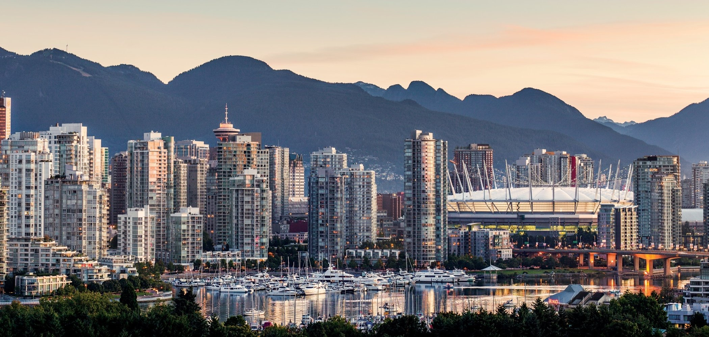

# IBM Data Science Capstone Project - The Battle of Neighborhoods in Vancouver

This repository is mainly for the IBM Data Science Capstone project on Coursera.

## Introduction
Vancouver, a bustling west coat seaport, is full of business opportunities. Millions of tourists come here every year to enjoy the beautiful scenery. So there are always unlimited possibilities for those who want to open their own restraurant. The biggest challenge they are facing is which location is the best that has relatively small competition, large passenger flow and good surrounding resources. To solve this question, the project is going to segment neighborhoods in Vancouver using a popular clustering technique, trying to figure out a solution for potential restaurant investors.

## Data 
The neighborhood data is scraped from [Wekipedia](https://en.wikipedia.org/wiki/List_of_neighbourhoods_in_Vancouver) and corresponding coordinates are obtained using [geocoder](https://geocoder.readthedocs.io/), and all data of venues in each neighborhoods is returned by [Foursquare API](https://developer.foursquare.com/). There are 20 official neighborhoods, which will be the main research objects.

## Analysis 
Please refer to [here](https://github.com/clsu22/IBM-Capstone-Project/blob/master/src/Final-Project-Analysis.ipynb) to see the whole analysis.

## Final Report 
Please refer to [here](https://github.com/clsu22/IBM-Capstone-Project/blob/master/doc/Final-report.md) to see the final report.

## Blogpost
Please refer to [here](https://clsu22.github.io/IBM_Capstone_Project/) to see my blogpost.

